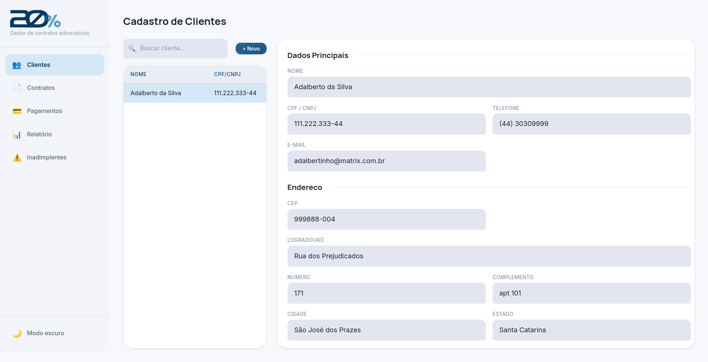
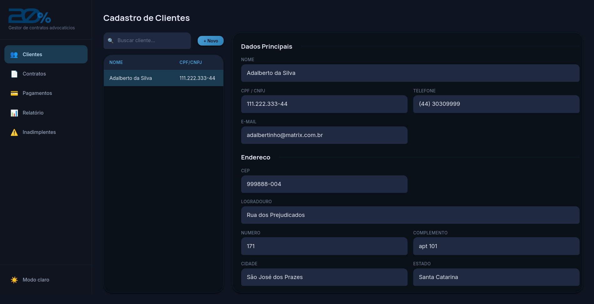
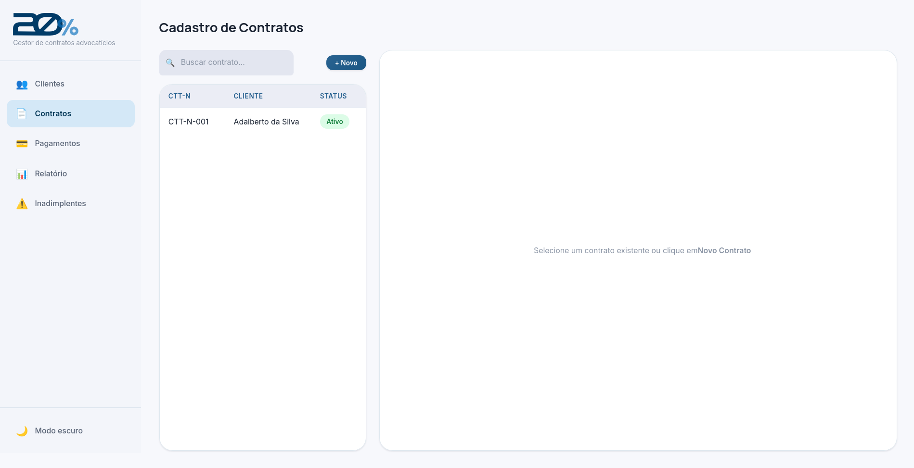
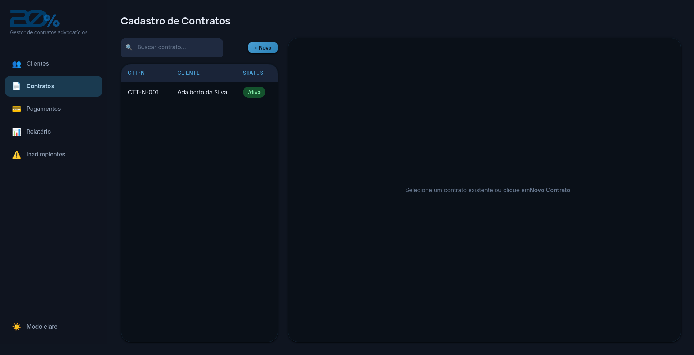
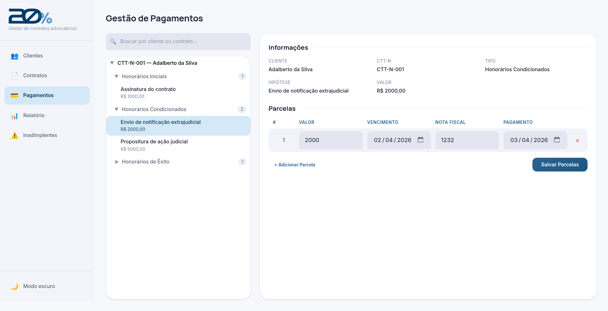
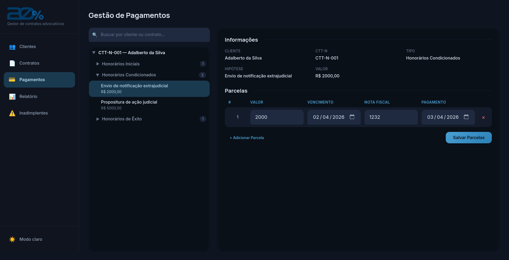
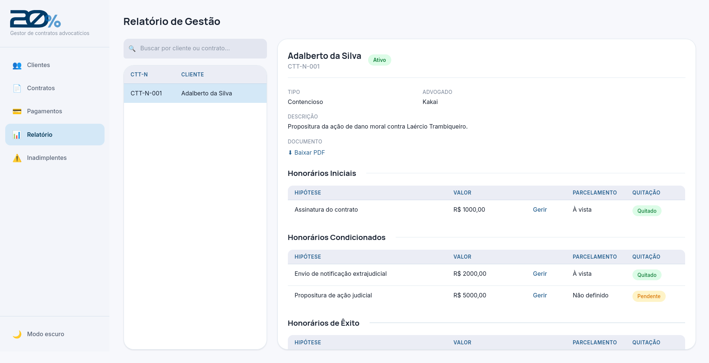
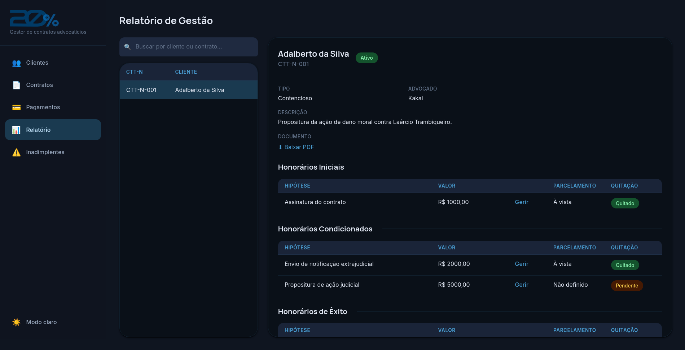

<p align="center">
  
</p>

<h3 align="center">Gestor de contratos advocatícios</h3>

<p align="center">
  
  
  
  
</p>

---

Sistema web para gestão de contratos jurídicos — clientes, honorários, parcelas e relatórios de inadimplência.

---

## Sobre o projeto

Este sistema foi criado por um **advogado entusiasta de tecnologia**, sem experiência prévia em desenvolvimento de software. Todo o código foi escrito com o auxílio do **[Claude Code](https://claude.ai/code)** (Anthropic).

O objetivo foi resolver uma necessidade real do escritório — controlar contratos, honorários e inadimplência — sem depender de planilhas ou sistemas genéricos. Se você também não é desenvolvedor mas quer criar suas próprias ferramentas, esse projeto é a prova de que é possível.

---

## Funcionalidades

- **Clientes** — cadastro com CPF/CNPJ, endereço completo e representante
- **Contratos** — numeração automática (CTT-N-001, CTT-N-002…), múltiplos clientes por contrato e upload de PDF
- **Honorários** — Tipos variados: inicial, condicionado, intermediário, mensal, êxito e hora trabalhada.
- **Parcelas** — controle de vencimento, data de pagamento e número de nota fiscal
- **Relatório gerencial** — visão completa do contrato com status de quitação
- **Inadimplentes** — dashboard de contratos com parcelas em atraso

- Temas: Claro e Escuro

---

## Screenshots

<table>
  <tr>
    <td>
      
    </td>
    <td>
      
    </td>
  </tr>
    <tr>
    <td>
      
    </td>
    <td>
      
    </td>
  </tr>
    <tr>
    <td>
      
    </td>
    <td>
      
    </td>
    <tr>
    <td>
      
    <td>
      
    </td>
    </td>
    </tr>
  </tr>
</table>

---

## Stack

| Camada    | Tecnologia                          |
|-----------|-------------------------------------|
| Backend   | Python 3.12 + FastAPI 0.115         |
| Frontend  | React 18 + TypeScript + Vite 5      |
| Banco     | SQLite (arquivo local, sem servidor)|
| Servidor  | Uvicorn (API) + Nginx (frontend)    |
| Deploy    | Docker Compose                      |

---

## Como rodar

### Pré-requisito

[Docker](https://docs.docker.com/get-docker/) instalado na máquina.

### Produção — imagens prontas do GitHub Container Registry

1. Baixe o arquivo de configuração:

```bash
curl -O https://raw.githubusercontent.com/Lmaykot/GestaoEsc/main/docker-compose.yml
```

2. Suba os containers:

```bash
docker compose up -d
```

3. Acesse:
   - **Aplicação:** http://localhost:3000
   - **API (Swagger):** http://localhost:8000/docs

---

### Desenvolvimento local

**Backend:**
```bash
cd backend
pip install -r requirements.txt
uvicorn app.main:app --reload
```

**Frontend:**
```bash
cd frontend
npm install
npm run dev
```

---

## Estrutura do projeto

```
GestaoEsc/
├── backend/
│   ├── app/
│   │   ├── main.py          # FastAPI app, CORS, rotas
│   │   ├── database.py      # Classe Database — todas as queries SQL
│   │   ├── models.py        # Schemas Pydantic
│   │   ├── dependencies.py  # Injeção de dependência (DB por request)
│   │   └── routers/
│   │       ├── clientes.py
│   │       ├── contratos.py
│   │       ├── honorarios.py
│   │       ├── parcelas.py
│   │       └── relatorio.py
│   ├── Dockerfile
│   └── requirements.txt
├── frontend/
│   ├── src/
│   │   ├── pages/           # CadastroCliente, CadastroContrato, GestaoPagamentos, Relatorio, Inadimplentes
│   │   ├── layouts/         # AppShell (navegação por abas)
│   │   ├── api/             # Funções de chamada à API
│   │   ├── assets/          # Logo e imagens
│   │   ├── design-system/   # Componentes UI reutilizáveis
│   │   └── types/           # Tipos TypeScript
│   ├── Dockerfile
│   └── vite.config.ts
├── Logo.svg
├── docker-compose.yml
└── .github/
    └── workflows/
        └── release.yml      # Build e publicação automática das imagens
```

---

## API

A documentação interativa da API está disponível em http://localhost:8000/docs (Swagger UI gerado automaticamente pelo FastAPI).

---

## Licença

MIT
